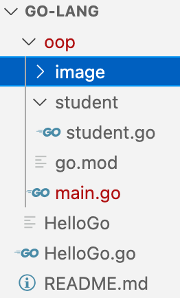

---
Direcotry Structure of VisualStudio

## Questions

6. setting golang app as windows service : this is out of scope now. Google search has lot of links available.
5. GO is object oriented or functional language : Functional Language
4. How to Check Go version : go version
3. What is equivalent of import statements for List,Set and Map in GO : import 
2. What is equivalent of java.lang package in GOLang : same as package
1. What is fmt in GOLANG : this is similar to System.out.println()

## Answers

