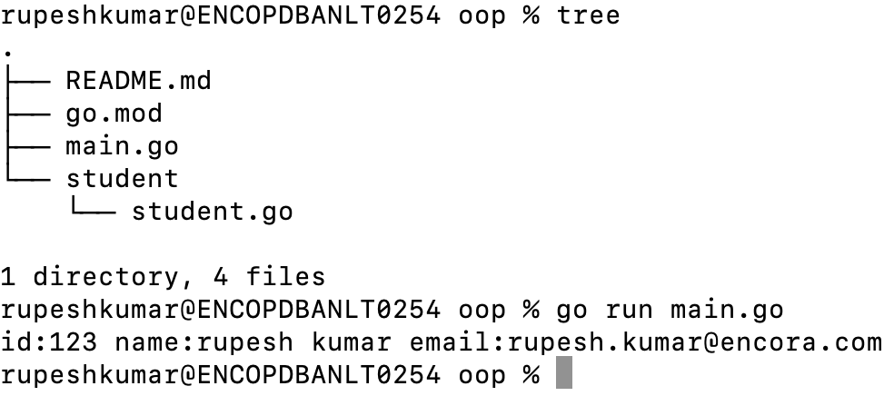

This folder shows how to call a function defined in a file to anohter file.
In this example <b>oop</b> is top folder and main.go file is calling a function defined in student/student.go file.

From java presepective constructor and toString method is used in this example. There is New function in student/student.go file which can be treated as constrcutor in java to create new instance of object.
ToString method is created to print all properties of class cum struct.

